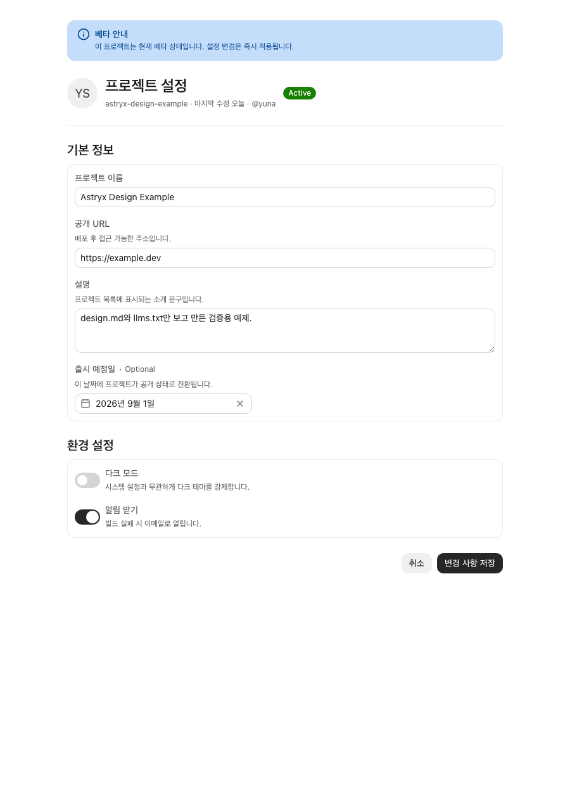
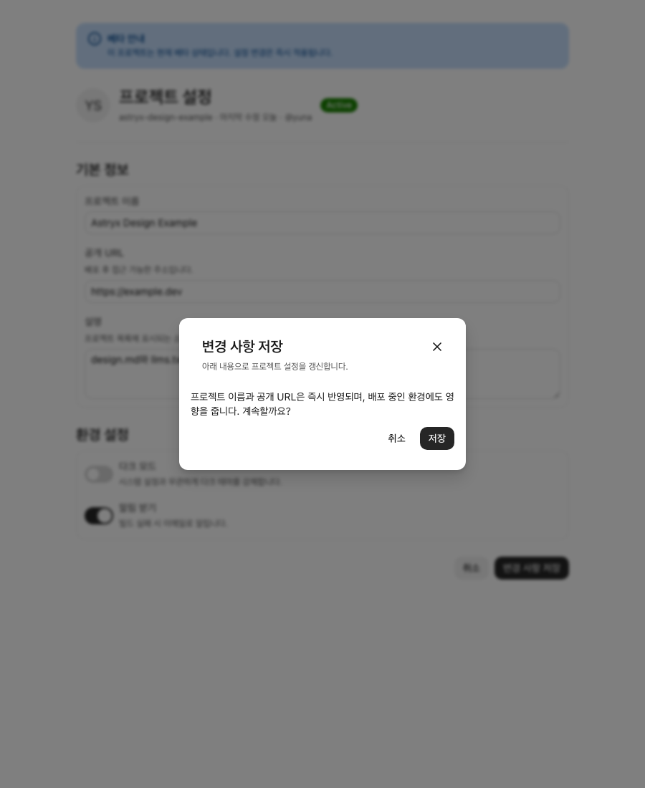
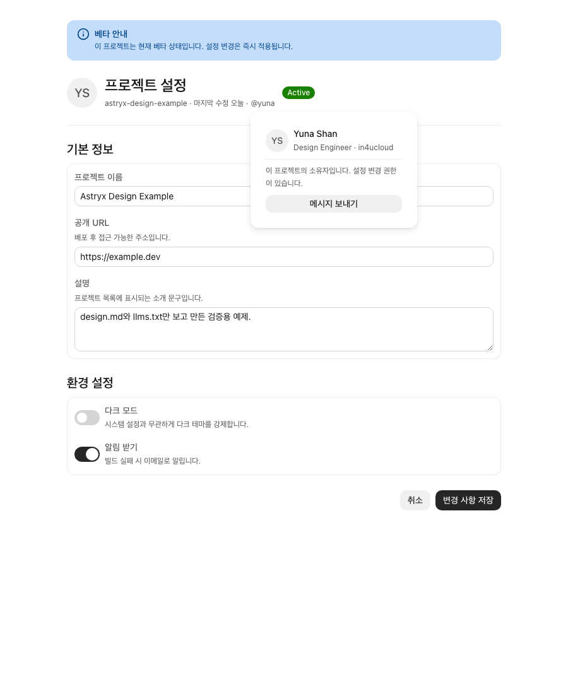

# astryx-design-md

> **우리는 Claude에게 문서만 주고 UI를 만들게 했다. 처음엔 타입 오류 17건, 문서를 고친 뒤엔 0건.**
> 이 저장소는 [facebook/astryx](https://github.com/facebook/astryx)에서 LLM용 문서(`design.md`, `llms.txt`, `llms-full.txt`)를 매일 자동 생성하고, **그 문서가 실제로 작동하는지 에이전트에게 코드를 짜게 해서 검증**한 기록입니다.

## 17 → 0: 검증 실험

LLM용 문서는 많지만, 그 문서로 에이전트가 실제로 올바른 코드를 짤 수 있는지 측정하는 경우는 드뭅니다. 우리는 직접 시켜봤습니다.

| | 참고 자료 | 결과 |
| --- | --- | --- |
| **시도 1** | `design.md` + `llms.txt`만 (props 정보 없음) | 컴포넌트 13개 임포트는 전부 성공, **타입 오류 17건** — `Banner variant`(실제는 `status`), `gap="lg"`(실제는 숫자 스케일), `defaultValue`(전부 controlled) 등 |
| **시도 2** | 실패에서 배운 2줄을 문서에 추가 + props 레퍼런스 | **tsc 0 오류, 빌드 성공, 정상 렌더링** — Dialog·HoverCard·DateInput은 첫 시도 통과 |

에이전트가 문서만 보고 만든 결과물:

| 설정 페이지 | Dialog | HoverCard |
| --- | --- | --- |
|  |  |  |

전체 실험 기록(무엇이 틀렸고, 어떤 문서 한 줄이 그걸 예방하는지)은 **[example/NOTES.md](example/NOTES.md)**, 실제 코드는 [example/](example/)에 있습니다.

핵심 교훈: **결과 품질을 결정한 건 저장소 접근 권한이 아니라, 압축·검증된 인터페이스였습니다.** 같은 모델·같은 저장소에서 무엇을 먹이느냐로 17건과 0건이 갈렸습니다.

## 생성되는 파일

| 파일 | 용도 |
| --- | --- |
| [`llms.txt`](llms.txt) | [llms.txt 표준](https://llmstxt.org) 인덱스 — 설치, 테마, CLI 부트스트랩, 그리고 **실패 데이터에서 증류한 함정 목록** (controlled 입력, 숫자 spacing 스케일 등) |
| [`llms-full.txt`](llms-full.txt) | 전체 레퍼런스 — 212개 컴포넌트의 import 경로·Do/Don't·**props 1,743개**(타입·기본값·설명) + 훅 27개의 파라미터/반환값. 저장소 접근이나 CLI 호출 없이 이 파일 하나로 원샷 코드 작성이 목표 |
| [`design.md`](design.md) | 사람용 설계 개요 — 아키텍처, 패키지, 카테고리별 컴포넌트 인벤토리, 스타일링 규칙 |

세 파일 모두 astryx의 특정 커밋 SHA에 고정되어 생성되며, 상단에 출처 커밋이 명시됩니다.

## 동작 방식

```
facebook/astryx (매일 clone)
  → scripts/generate.py            # Python 3.9+, 표준 라이브러리만
     ├─ package.json / README 파싱
     ├─ 212개 *.doc.mjs 파싱        # 문자열/주석 인식 미니 파서
     │    (중국어 docsZh 제외, components 배열 평탄화, 훅 params/returns)
     └─ design.md / llms.txt / llms-full.txt 생성
  → GitHub Actions (매일 00:00 UTC, 09:00 KST)
     └─ 변경이 있을 때만 커밋       # 문서에 SHA가 박혀 있어 업스트림이 바뀐 날만 diff 발생
```

수동 실행:

```bash
python3 scripts/generate.py                              # astryx를 임시 디렉터리에 clone
ASTRYX_DIR=/path/to/astryx python3 scripts/generate.py   # 기존 clone 재사용
```

예제 앱 실행:

```bash
cd example && npm install && npm run dev
# ?demo=dialog / ?demo=hovercard 쿼리로 오버레이 열린 상태 재현
```

## 왜 "클로드한테 링크 주고 시키면" 안 되나

됩니다 — 실제로 이 저장소가 그렇게 만들어졌습니다. 하지만:

- astryx는 클론만 519MB, 2,300개 모듈입니다. 매 세션 이걸 탐색하는 건 토큰·시간 낭비이고 결과도 세션마다 다릅니다.
- 위 실험이 보여주듯, 원시 코드 접근보다 **정제된 레퍼런스가 정확도를 만듭니다.** 한 번 생성해 검증하고 SHA에 고정해 N명이 쓰는 쪽이 매번 재유도하는 것보다 낫습니다.
- "LLM이 어떤 문서 공백에서 어떻게 틀리는가"의 축적은 스크래핑으로 재현되지 않습니다.

## 로드맵

- [ ] 검증 루프 자동화 — 생성된 문서로 에이전트에게 샘플 과제를 시키고 원샷 성공률을 매일 기록
- [ ] 임의 저장소로 일반화 — astryx 전용 파서를 넘어 "검증된 llms-full.txt 레지스트리"로
- [ ] facebook/astryx 업스트림에 llms.txt / llms-full.txt 기여 제안

## 라이선스

생성기 코드는 MIT. 생성된 문서의 내용은 [facebook/astryx](https://github.com/facebook/astryx) (MIT)에서 파생됩니다.
